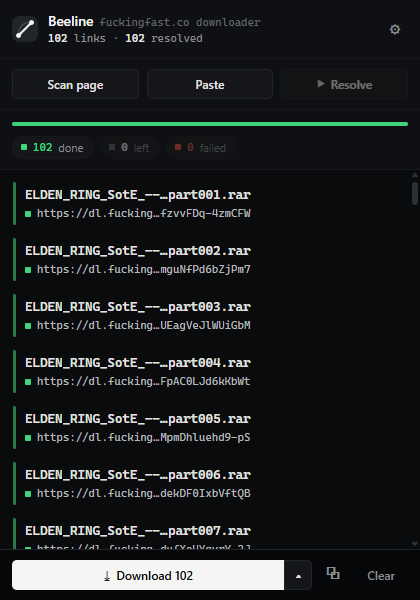

# Beeline - fuckingfast.co downloader

Downloads for **Beeline**, a Manifest V3 browser extension that collects fuckingfast.co share
links from a page, resolves them to their final direct download URLs, and hands those to a
downloader: the browser's own, JDownloader, or IDM.

This repository holds the release builds. The extension is developed in a private repo;
its source is not private. Every zip here is the whole extension, unminified.

---

## Screenshots



A finished batch. The header counts, the progress bar and the footer button all track
the queue while it runs, and each row turns green as its direct link lands.

---

## Install

**Chrome / Edge / Brave** (requires Chrome 116 or later)

1. Download `beeline-<version>-chrome.zip` from [Releases](../../releases/latest)
2. Unzip it somewhere permanent. Chrome loads it from this folder every launch, so
   don't leave it in Downloads and don't delete it afterwards.
3. Open `chrome://extensions` and turn on **Developer mode**
4. Click **Load unpacked** and select the unzipped folder
5. Pin the toolbar icon. The badge shows resolve progress.

Chrome shows a "disable developer mode extensions" prompt on startup for extensions
installed this way. Dismissing it is fine, the extension keeps working.

---

## Updating

There is no auto-update on this install method. To move to a new version:

1. Download and unzip the new release
2. Replace the old folder with the new one, keeping the same path
3. Open `chrome://extensions` and hit reload on the Beeline card

Settings and queued links are stored by Chrome, not in the folder, so they survive
an update.

---

## Use it

1. Open a page containing fuckingfast.co links
2. Click the toolbar icon and choose **Scan page**, or right-click the page and pick
   *Beeline: resolve every link on this page*
3. Hit **Resolve**. Rows turn blue while working and green once the direct URL is in hand.
4. Hit **Download**. Everything resolved goes to the browser's own downloader, to
   JDownloader, or to IDM, whichever you picked in settings. The caret beside the button
   holds the other two, plus **.txt**, **aria2** and an IDM `.ef2` import file, and the
   copy button takes the direct links to your clipboard.

`Alt+Shift+F` opens the popup from anywhere.

### Sending to a download manager

**JDownloader** needs nothing installed. Beeline posts the batch to the Click'n'Load
listener JDownloader already runs on `127.0.0.1:9666`, and it starts downloading.

**IDM** takes over downloads the browser *navigates* to, not ones an extension queues, so
Beeline opens each link in one background tab and lets IDM's Integration Module grab it.
That means one IDM dialog per file. To skip the dialogs, see the native host below.

---

## Reporting a problem

Open an issue here. Include your Chrome version, the extension version, and anything
logged in the service worker console (`chrome://extensions`, then **service worker**
on the Beeline card).

---

## Verifying the download

**Checksum.** Confirm the zip you downloaded is the one that was published:

```
SHA-256  036575304d5a362f0a31e919cc6e0c0a61846805fcc64d9a6955e963c10283c7
         beeline-0.0.1-chrome.zip
```

- Windows: `certutil -hashfile beeline-0.0.1-chrome.zip SHA256`
- macOS: `shasum -a 256 beeline-0.0.1-chrome.zip`
- Linux: `sha256sum beeline-0.0.1-chrome.zip`

This proves the file was not altered in transit. It does not prove the file is safe,
and no checksum ever can.

**Scan it.** Upload the zip to [VirusTotal](https://www.virustotal.com) and read the
result yourself rather than trusting a link posted here. Note that an extension is
plain JavaScript, so signature scanners tell you very little either way.

**Watch what it does.** The most direct check. Open `chrome://extensions`, click
**service worker** on the Beeline card, and use the Network tab while resolving a
link. Every request the extension makes is listed there.

---

## What the permissions are for

| Permission | Why |
|---|---|
| `storage` | Settings, the queue, recent history. Stored locally by Chrome. |
| `activeTab` | Reads links from the page when you press Scan. |
| `tabs` | Tracks the helper tabs it opens so it can close them again. |
| `scripting` | Runs the resolver in a helper tab when fuckingfast.co demands a Cloudflare token. |
| `downloads` | Saves your exported `.txt` or aria2 file. Also cancels the stray download the click fallback can start. |
| `notifications` | One notification when a batch finishes. |
| `contextMenus` | The two right-click entries. |
| `alarms` | A short keepalive so the service worker is not evicted mid-queue. |
| `declarativeNetRequestWithHostAccess` | Sets `Referer` and `Origin` on the extension's own background requests to fuckingfast.co. |
| `nativeMessaging` | Talking to the optional IDM helper described below, and nothing else. It is listed at install even if you never set the helper up, because a service worker cannot pick up a permission granted later. |

Two of these look worse than they are, so to be specific about their limits:

The request rule is scoped to `tabIds: [-1]` and `resourceTypes: ['xmlhttprequest']`,
meaning it applies only to requests the extension itself makes in the background. It
cannot modify traffic from any tab you are browsing in.

The downloads listener does receive an event for every download you start, but it
exits immediately unless the URL is one the extension just resolved or the referrer is
fuckingfast.co, and it always leaves alone downloads it started itself. Downloads
unrelated to the extension are untouched.

**Site access.** At install it can only touch `*://*.fuckingfast.co/*`. Two further
permissions are optional and are not granted at install: all-sites `*://*/*`, requested
only if you turn on auto-detect so it can find links on other pages, and
`http://127.0.0.1/*`, requested only if you choose JDownloader. Both are released again
when you switch the feature off, and either can be revoked from `chrome://extensions` at
any time.

---

## The IDM helper

Optional, Windows only, and the one part of this that is not just JavaScript. Skip it
unless you use IDM and want a batch to queue without a dialog per file.

`native/beeline-idm.cs` is a native messaging host. `native/install.ps1` compiles it to
`beeline-idm.exe` with the C# compiler that ships with Windows, then registers it under
`HKCU` so your browser can start it. Nothing is downloaded to build it, and nothing runs
until you run that script yourself.

What the host does, in full: it reads one message from the extension, locates `IDMan.exe`
through its own registry entry, runs `IDMan.exe /d <url> /f <name> /n /a` once per link
and then `/s` to start the queue, and replies with a count. It accepts only `http` and
`https` URLs, passes every argument separately so a URL cannot become a switch, and talks
to nothing but IDM. The source is in the zip, it is about 200 readable lines, and
`install.ps1 -Uninstall` removes the exe and the registry keys again.

Without it, Beeline uses the tab route above and IDM asks about each file.

---

## The source, and what you may do with it

Copyright (c) 2026 de18u, all rights reserved. See `COPYRIGHT` in the zip. No licence is
granted: read it, run it, audit it, but do not redistribute it or ship a modified version.

Development happens in a private repo. That is a distribution split, not a secrecy one:
GitHub ties release asset visibility to repository visibility, so a private repo cannot
hand out a downloadable build, which is why this second repo exists.

None of that hides the code, and that is the point. A browser extension ships as plain
source, so the zip you download *is* the extension: roughly 4,000 lines of JavaScript, CSS
and HTML, unminified, with no build step and no bundler standing between what was written
and what runs. `src/` is the extension and `native/beeline-idm.cs` is the optional IDM
helper. Nothing is fetched at runtime.

So there is no binary here to take on faith. Unzip it and read it before you load it.

---

## On trust

This is distributed outside the Chrome Web Store, so no reviewer has vetted it, and it
installs in developer mode. If you are not comfortable running an unreviewed extension
that can request access to every site, the reasonable thing is not to install it.
